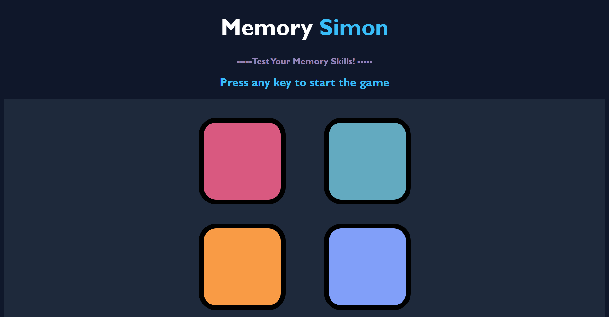

# 🧠 Memory Simon

**Memory Simon** is an interactive browser-based memory game inspired by the classic Simon game. Players must observe and repeat an increasingly long sequence of colors, with each level introducing a new challenge. The project demonstrates JavaScript game logic, DOM manipulation, event-driven programming, and responsive UI design.

---

## 🎮 Live Demo

🔗 **Play Here:** https://your-live-demo-link.com

---

## 📸 Preview





---

## ✨ Features

- 🎯 Interactive memory-based gameplay
- 🎲 Random color sequence generation
- 📈 Dynamic level progression
- ⚡ Smooth button flash animations
- 👆 Click-based user interaction
- ❌ Instant game-over detection
- 🔄 Restart game with a single key press
- 🎨 Modern dark-themed responsive interface

---

## 🛠️ Tech Stack

- HTML5
- CSS3
- JavaScript (ES6+)

---

## 📂 Project Structure

```
Memory-Simon/
│
├── index.html
├── style.css
├── script.js
├── README.md
├── LICENSE
└── preview.png
```

---

## 🚀 How to Play

1. Press any key to start the game.
2. Watch the sequence of flashing colors carefully.
3. Repeat the exact sequence by clicking the colored buttons.
4. Every successful round adds one more color to the sequence.
5. The game ends when an incorrect button is clicked.
6. Press any key to restart and challenge yourself again.

---

## 💻 Concepts Practiced

- DOM Manipulation
- Event Handling
- Arrays
- Random Number Generation
- Game State Management
- JavaScript Functions
- CSS Animations
- Responsive Web Design

---

## 🔮 Future Improvements

- 🏆 Best Score using Local Storage
- 🔊 Sound Effects
- 🎵 Background Music
- 🌙 Multiple Difficulty Levels
- 📱 Enhanced Mobile Experience
- 🌐 Online Leaderboard
- 👤 User Profiles

---

## 👨‍💻 Author

**Raghav Bansal**

📧 Email: bansalraghav008@gmail.com

💼 GitHub: https://github.com/theraghavbansal

---

## 📄 License

This project is licensed under the **MIT License**.

---

⭐ If you enjoyed this project or found it useful, consider giving it a star!
